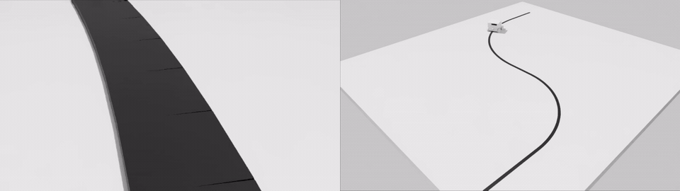

# Sim2Real Line-Following Robot

This project takes you from training a line-following policy in Isaac Lab to
deploying that policy on an ESP32-S3 robot with Arduino IDE.



You do not need a pretrained model. By following this README from the correct
starting point, you will create:

| Output | Purpose |
|---|---|
| `model_*.pt` | PPO model trained in Isaac Lab |
| `policy.onnx` | Intermediate model used for firmware export |
| `line_following_policy.h` | C policy compiled into the ESP32-S3 firmware |

The complete workflow is **install → validate simulation → train BC → train PPO
→ evaluate 40 scenarios → export policy → Arduino Upload → run the robot**.

## 1. Before you begin

This README supports two starting points.

### A. Isaac Sim and Isaac Lab are already installed

If you already installed Isaac Sim and Isaac Lab by following NVIDIA's
**Installation using Isaac Sim Pip Package** procedure, and that installation
uses the validated stack listed below, do **not** reinstall or move Isaac Lab.
Activate the existing environment and continue directly to **Step 6**.

Your existing IsaacLab source repository may be located anywhere. Do not clone
this robot project inside the IsaacLab repository. Step 6 creates a separate
project workspace under `$HOME/robotics/line-following-robot-pai`.

### B. New computer or clean installation

If Isaac Sim and Isaac Lab are not installed yet, follow **Steps 1-5** in this
README. Steps 2-5 reproduce NVIDIA's **Installation using Isaac Sim Pip
Package** workflow for Linux x86_64, so you do not need to open the NVIDIA
installation page separately while following this guide.

Reference: [NVIDIA Isaac Lab - Installation using Isaac Sim Pip Package](https://isaac-sim.github.io/IsaacLab/main/source/setup/installation/pip_installation.html)

This project uses the following validated base stack:

| Component | Validated version |
|---|---|
| Validated OS | Ubuntu 24.04 LTS 64-bit |
| Python | 3.11 |
| Isaac Sim | 5.1.0 |
| Isaac Lab | v2.3.2 |
| PyTorch | 2.7.0, CUDA 12.8 wheel |
| torchvision | 0.22.0 |
| NVIDIA driver | 580.65.06 or newer |

NVIDIA's `main` documentation tracks the current Isaac Lab development branch.
This README intentionally pins **Isaac Lab v2.3.2** instead of tracking `main`
so that the project uses a reproducible version that can be tested consistently.

For a new installation, the recommended directory layout is:

| Path | Purpose |
|---|---|
| `$HOME/IsaacLab/` | NVIDIA Isaac Lab source |
| `$HOME/robotics/line-following-robot-pai/` | This project |
| `$HOME/miniconda3/envs/env_isaaclab/` | Python environment |

The Conda environment, the IsaacLab source repository, and this project are
three separate things. Activating `env_isaaclab` does not change your current
directory.

Your computer needs:

- Linux x86_64 with GLIBC 2.35 or newer;
- an NVIDIA RTX GPU with at least 16 GB VRAM;
- NVIDIA driver 580.65.06 or newer;
- at least 32 GB RAM and 50 GB of free SSD space;
- a stable Internet connection for the first installation.

This guide is validated on Ubuntu 24.04 LTS. Other recent Linux x86_64
releases, including newer Ubuntu versions, are not blocked by the project and
may work when the required NVIDIA/Isaac stack and `doctor` checks pass.
Windows, WSL, and macOS have not been validated.

### How to use the command blocks

1. Open Terminal with `Ctrl + Alt + T`.
2. Copy and paste **one command block at a time**.
3. Press `Enter` and wait for the block to finish before continuing.
4. Do not copy a leading `$` from examples found elsewhere.
5. Stop if you see `[FAIL]`, `Error`, or `Traceback`, or if the command never
   returns to the terminal prompt. Do not continue by ignoring an error.

> [!NOTE]
> Copyable code blocks in this README are reserved for commands you can paste
> into Terminal. Expected output, status messages, file paths, and examples are
> shown as normal text or notes so they are not mistaken for commands.

Check the GPU and GLIBC first:

```bash
nvidia-smi
ldd --version | head -n 1
```

`nvidia-smi` must show the GPU name, driver version, and VRAM. The GLIBC version
must be 2.35 or newer. If either check fails, repair the system installation
before continuing.

## 2. Install system tools and Miniconda

If you are following **Path A** above, skip to Step 6. Otherwise run:

```bash
sudo apt update
sudo apt install -y git wget cmake build-essential
cd /tmp
wget https://repo.anaconda.com/miniconda/Miniconda3-latest-Linux-x86_64.sh -O miniconda.sh
bash miniconda.sh -b -p "$HOME/miniconda3"
"$HOME/miniconda3/bin/conda" init bash
```

Close Terminal, open a new Terminal, and verify the installation:

```bash
git --version
conda --version
nvidia-smi
```

All three commands must run successfully.

## 3. Create the Python environment

```bash
conda create -n env_isaaclab python=3.11 -y
conda activate env_isaaclab
python -m pip install --upgrade pip
```

After `conda activate`, the terminal prompt must begin with **`(env_isaaclab)`**.

## 4. Install and verify Isaac Sim 5.1

Keep `env_isaaclab` active and install Isaac Sim exactly through the pip-package
workflow used by NVIDIA:

```bash
python -m pip install "isaacsim[all,extscache]==5.1.0" --extra-index-url https://pypi.nvidia.com
python -m pip install -U torch==2.7.0 torchvision==0.22.0 --index-url https://download.pytorch.org/whl/cu128
```

Start Isaac Sim once:

```bash
isaacsim
```

Accept the NVIDIA EULA if prompted. The first launch may take more than ten
minutes while extensions are downloaded and the shader cache is built. When
Isaac Sim has opened completely, close it and return to Terminal.

## 5. Install and verify Isaac Lab

Keep `env_isaaclab` active. Isaac Lab is installed separately from this robot
project. For a new installation, place the NVIDIA repository directly under
your home directory:

```bash
cd "$HOME"
git clone https://github.com/isaac-sim/IsaacLab.git --branch v2.3.2
cd IsaacLab
./isaaclab.sh --install rsl_rl
```

The NVIDIA documentation normally demonstrates the same source-install workflow
with the current `main` branch. This guide uses the `v2.3.2` tag so the teaching
project does not change when NVIDIA updates `main`.

Verify Isaac Lab from the top of the IsaacLab repository:

```bash
./isaaclab.sh -p scripts/tutorials/00_sim/create_empty.py
```

An empty Isaac Sim window should open. Press `Ctrl + C` in Terminal to stop the
program, and then close the Isaac Sim window.

At this point the NVIDIA stack is installed. Do not place the robot project
inside `$HOME/IsaacLab`.

## 6. Download the robot project

Whether you used an existing NVIDIA installation or completed Steps 1-5 above,
start the project itself in a separate directory:

```bash
conda activate env_isaaclab
mkdir -p "$HOME/robotics"
cd "$HOME/robotics"
git clone https://github.com/SangHuynhVan272/sim2real-line-following-robot.git line-following-robot-pai
cd line-following-robot-pai
```

The intended layout is therefore:

- `$HOME/IsaacLab/` — NVIDIA framework for a new installation.
- `$HOME/robotics/line-following-robot-pai/` — this project.

If you already had Isaac Lab in another directory, leave it there. Only the
robot project is placed under `$HOME/robotics`.

### 6.1 Check the existing NVIDIA base environment

Before adding project-specific packages, confirm that the active environment
matches the base versions used by this project:

```bash
python - <<'PY'
from importlib.metadata import version

required = {
    "isaacsim": "5.1.0",
    "torch": "2.7.0",
    "torchvision": "0.22.0",
}

errors = []
for package, expected in required.items():
    actual = version(package)
    if not (actual == expected or actual.startswith(expected + "+") or actual.startswith(expected + ".")):
        errors.append(f"{package}: expected {expected}, found {actual}")

import isaaclab
import isaaclab_rl
import rsl_rl

if errors:
    raise SystemExit(
        "Base NVIDIA environment does not match this project:\n  "
        + "\n  ".join(errors)
        + "\nDo not force-downgrade a different working Isaac Lab environment. "
          "Use a clean env_isaaclab by following Steps 2-5 instead."
    )

print("Base NVIDIA environment OK")
PY
```

If this check reports a version mismatch, stop. Do not modify a different
working Isaac Lab environment just to make this project pass.

### 6.2 Install the project compatibility packages

The NVIDIA installation above provides Isaac Sim, PyTorch, Isaac Lab, and
`rsl_rl`. This project also pins a small set of Python packages used by its
validation and export tools. Install them only after the base check passes:

```bash
python -m pip install torchaudio==2.7.0 --index-url https://download.pytorch.org/whl/cu128
python -m pip install numpy==1.26.0 onnx==1.20.1 pillow==11.3.0 click==8.1.7 psutil==5.9.8 typing_extensions==4.12.2
```

These commands do not clone or reinstall Isaac Sim or Isaac Lab.

Run every remaining command from the `line-following-robot-pai` directory.

Whenever you open a new Terminal, run these three commands first:

```bash
conda activate env_isaaclab
cd "$HOME/robotics/line-following-robot-pai"
python tools/project.py doctor
```

> [!IMPORTANT]
> Continue only when the final line says **`Environment check PASS. This terminal
> is ready for the project commands.`** An optional `[SKIP]` is normal. A
> `[FAIL]` is not normal and must be fixed before you continue.

## 7. Validate the source and simulation

Check the downloaded project files:

```bash
python tools/project.py source-check
```

> [!NOTE]
> Expected result: **`[PASS] Repository files, JSON, Markdown links and Python syntax`**

Generate the robot USD and compare the two simulation implementations:

```bash
python tools/project.py import-robot
python tools/project.py parity
```

> [!NOTE]
> The `parity` command should end with **`PARITY OK`**.

Run two camera episodes before training:

```bash
python tools/project.py smoke
```

Both episodes must print `[PASS] Camera episode`.

To watch the robot in Isaac Sim before training, run:

```bash
python tools/project.py gui
```

Select `RobotCamera` to see the image used by the controller, or select
`TeachingOverviewCamera` to see the complete track. Press `Ctrl + C` in
Terminal when you want to close the simulation.

## 8. Train the model

Training has two stages. Behavior Cloning creates a reliable starting point,
and PPO then improves the policy in randomized environments.

### 8.1 Train the Behavior Cloning warm start

```bash
python tools/project.py train-bc --output-dir isaac_sim/output/rl/bc_candidate
```

Do not close Terminal while this command is running. When it finishes,
`isaac_sim/output/rl/bc_candidate/model_bc.pt` must exist.

Check it with:

```bash
test -f isaac_sim/output/rl/bc_candidate/model_bc.pt && echo "BC MODEL OK"
```

Continue only when `BC MODEL OK` is printed.

### 8.2 Train PPO

```bash
python tools/project.py train-ppo --bc-run isaac_sim/output/rl/bc_candidate --output-dir isaac_sim/output/rl/ppo_candidate --iterations 600
```

> [!NOTE]
> Training is complete when Terminal prints **`training complete; checkpoints in ...`**.

For the normal teaching workflow, **do not hard-code a checkpoint filename**.
You do not need to know whether the last model is `model_599.pt`,
`model_699.pt`, or another iteration number. Step 9 automatically uses the
newest saved checkpoint.

> [!TIP]
> **Optional — search for a stronger saved checkpoint**
>
> Skip this box on your first run. If you want to compare the saved PPO
> checkpoints and use the one with the highest validation score, run:
>
> ```bash
> python tools/project.py select-checkpoint
> ```
>
> This evaluates every saved `model_*.pt` checkpoint on validation seeds 0-19
> and records the selected checkpoint. It can take much longer than evaluating
> one model. After it finishes, continue to Step 9 normally.

## 9. Evaluate the trained model

The evaluation sets measure how robust the checkpoint is. They are performance
scores, not deployment gates.

First resolve the checkpoint automatically:

```bash
CHECKPOINT="$(python tools/project.py checkpoint-path)"
echo "Using checkpoint: $CHECKPOINT"
```

If you skipped the optional box in Step 8.2, this uses the newest saved
checkpoint. If you ran `select-checkpoint`, it uses the checkpoint selected by
that command.

Now evaluate it on validation seeds 0 through 19:

```bash
python tools/project.py gate --checkpoint "$CHECKPOINT"
```

> [!NOTE]
> Example result: **`Evaluation score: 19/20 randomized scenarios passed; nominal=PASS`**

Higher is better. `20/20` is the best possible score on this 20-scenario set,
`19/20` is stronger than `18/20`, and so on. A score below `20/20` means
the policy failed in more test scenarios; it does **not** mean the software
failed, and it does not prevent export or deployment.

After the checkpoint is selected, run the holdout on seeds 20 through 39:

```bash
CHECKPOINT="$(python tools/project.py checkpoint-path)"
python tools/project.py holdout --checkpoint "$CHECKPOINT"
```

> [!NOTE]
> Example holdout result: **`Evaluation score: 20/20 randomized scenarios passed; nominal=PASS`**

Record both scores with the checkpoint you selected. You may continue to Step
10 regardless of whether either score is 20/20. If you want a stronger model,
you can inspect failed seeds, compare checkpoints on the validation set, or
retrain before export.

## 10. Convert the model into an ESP32-S3 policy

Export the selected checkpoint to ONNX:

```bash
CHECKPOINT="$(python tools/project.py checkpoint-path)"
python tools/project.py export-onnx --checkpoint "$CHECKPOINT" --onnx isaac_sim/output/rl/ppo_candidate/policy.onnx
```

Check the ONNX file:

```bash
test -f isaac_sim/output/rl/ppo_candidate/policy.onnx && echo "ONNX OK"
```

Continue only when `ONNX OK` is printed.

Convert the ONNX model into a C header and place it in the directory used by
the Arduino firmware:

```bash
POLICY_VERSION="$(date +%Y%m%d_%H%M%S)_ppo_student"
python tools/project.py export-header --onnx isaac_sim/output/rl/ppo_candidate/policy.onnx --version-name "$POLICY_VERSION"
```

Check the firmware policy:

```bash
test -f firmware/generated/line_following_policy.h && echo "FIRMWARE POLICY OK"
```

Continue only when `FIRMWARE POLICY OK` is printed.

Do not copy the `.pt` or `.onnx` file into Arduino. Arduino uses only the C
header generated at `firmware/generated/line_following_policy.h`.

## 11. Test the exact policy that will be uploaded

Run a short test using the generated C header:

```bash
python tools/project.py deployed-smoke
```

This checks that the exported header can be loaded and executed. Episode
completion is reported as performance information; a route that does not
complete is not treated as a software error as long as the simulation itself
runs and writes a valid result.

Run the same two 20-scenario evaluation sets using the generated C header:

```bash
python tools/project.py deployed-gate
python tools/project.py deployed-holdout
```

> [!NOTE]
> Each command prints an evaluation score, for example:
> **`Evaluation score: 19/20 randomized scenarios passed; nominal=PASS`**

Compare these scores with the original `.pt` checkpoint. Ideally the exported
C policy should reproduce similar behavior. A lower score does not by itself
block firmware upload, but a large unexpected difference is a reason to inspect
the export, manifest, and failed scenario diagnostics before relying on the
policy.

## 12. Upload the policy with Arduino IDE

### 12.1 Install Arduino IDE and ESP32 support

1. Download the latest [Arduino IDE 2](https://www.arduino.cc/en/software) and
   choose **Linux AppImage (64-bit X86-64)**.

2. Make the downloaded AppImage executable and open it:

```bash
ARDUINO_APPIMAGE="$(ls -t "$HOME"/Downloads/arduino-ide_*_Linux_64bit.AppImage 2>/dev/null | head -n 1)"
chmod +x "$ARDUINO_APPIMAGE"
"$ARDUINO_APPIMAGE"
```

3. Open **File > Preferences** and add
   `https://espressif.github.io/arduino-esp32/package_esp32_index.json` to
   **Additional Boards Manager URLs**.

4. Open **Tools > Board > Boards Manager**.
5. Search for `esp32 by Espressif Systems`.
6. Select version **3.3.11** and click **Install**.

### 12.2 Open the firmware

In Arduino IDE, select **File > Open** and open
`$HOME/robotics/line-following-robot-pai/firmware/esp32s3_line_following/esp32s3_line_following.ino`.

Arduino IDE will compile this sketch together with the policy in
`firmware/generated/`.

### 12.3 Select the board and upload

1. Keep the robot battery power switched off.
2. Connect the robot to the computer with its USB data cable.
3. Select **Tools > Board > esp32 > ESP32S3 Dev Module**.
4. Select the robot USB port under **Tools > Port**.
5. Click **Upload** and wait for `Done uploading`.

The Serial Monitor is optional. If you want to inspect the loaded policy before
disconnecting USB, open **Tools > Serial Monitor**, select `115200 baud`, and
look for a line like **`policy_id=... config_id=... mirror=... flip=...`**.

Serial Monitor is not required for normal operation.

After the upload:

1. Close Serial Monitor if it is open.
2. Disconnect the USB cable from the robot.
3. Place the robot correctly over the line.
4. Switch on the robot battery power.

The firmware waits for three valid camera frames containing the line and then
starts the trained policy automatically.

## 13. Your generated result files

- `isaac_sim/output/rl/bc_candidate/model_bc.pt`
- `isaac_sim/output/rl/ppo_candidate/model_*.pt`
- `isaac_sim/output/rl/ppo_candidate/policy.onnx`
- `firmware/policies/<policy-version>/`
- `firmware/generated/line_following_policy.h`
- `firmware/generated/line_following_policy_manifest.json`
- `firmware/generated/line_following_policy_vectors.csv`

These files are generated locally and are not uploaded to Git automatically.
Never edit the weights in `line_following_policy.h` by hand.

## 14. Troubleshooting

| Symptom | Action |
|---|---|
| The prompt does not show `(env_isaaclab)` | Run `conda activate env_isaaclab` |
| `python: command not found` | Activate `env_isaaclab`, then try again |
| `ModuleNotFoundError: isaaclab` | Activate the environment used for Isaac Lab. If you followed Steps 2-5, enter `$HOME/IsaacLab` and rerun `./isaaclab.sh --install rsl_rl` |
| `torch.cuda.is_available()` is `false` | Repair the NVIDIA driver and reinstall the cu128 PyTorch packages from Step 4 |
| `doctor` reports a different Torch/torchvision version | Do not force-downgrade another working Isaac Lab environment; create the validated `env_isaaclab` by following Steps 2-5 |
| The first Isaac Sim launch takes a long time | Wait for extensions and shaders to finish downloading |
| `No space left on device` | Check free SSD space and close applications using many file watchers |
| `PARITY` does not end with `PARITY OK` | Do not train; restore the correct source and configuration first |
| Validation or holdout score is below 20/20 | This is a model-performance result, not a software failure. Review failed seeds or retrain if you want a stronger model; export and deployment are still allowed |
| Arduino cannot find `line_following_policy.h` | Complete Step 10 before verifying the sketch |
| Arduino cannot find `esp_camera.h` | Install ESP32 by Espressif Systems 3.3.11 and select the ESP32-S3 board |
| The USB port is not listed | Use a USB data cable, try another port, or correct Ubuntu serial-port permissions |

When requesting help, run the following commands and provide their complete
output together with the first error line:

```bash
conda activate env_isaaclab
cd "$HOME/robotics/line-following-robot-pai"
python tools/project.py doctor
python tools/project.py source-check --skip-cpp
```

## 15. License

The project source, documentation, CAD files, and generated policy artifacts
are released under the [BSD 3-Clause License](LICENSE). Third-party frameworks
and packages retain their own licenses; see
[THIRD_PARTY_NOTICES.md](THIRD_PARTY_NOTICES.md).
